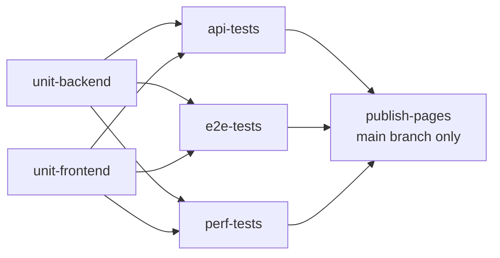
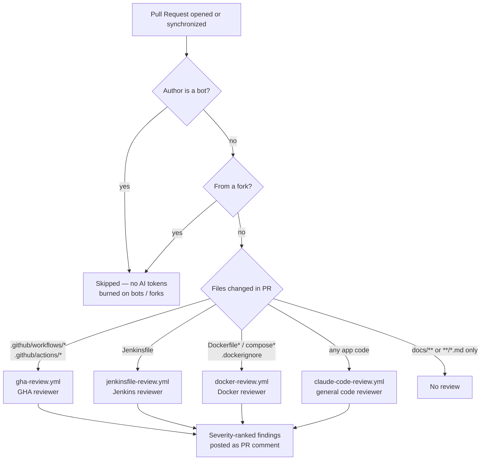

# Bug Tracker — CI/CD Reference Pipelines

A reference implementation of QA test-automation CI/CD on two parallel stacks: **GitHub Actions** and **Jenkins**.

The showcase piece is the **AI review fleet** — four specialized `claude-code-action` reviewers (GHA workflows, Jenkinsfile, Docker, application code) dispatched by changed paths, hardened against prompt injection, and capped by hard token budgets; the GHA and Docker reviewers share a reusable `_ai-review.yml` scaffold. Running alongside it is a non-AI **Trivy security layer** (`security-scan.yml`) that scans dependencies, IaC, and built images on every code change. See [Claude Code on Pull Requests](#claude-code-on-pull-requests).

The bug-tracker application (Go backend, Next.js frontend) is the test substrate — the value of this repository lies in how the pipelines are designed, what they enforce, and how the two stacks stay functionally equivalent.

For application setup, local dev commands, and stack details, see [APP.md](./APP.md).

---

## Repository Layout

```
.github/
├── workflows/                     # GHA workflow files (see Workflow Matrix below)
│   ├── ci.yml                     #   main CI — tests + reporting + GitHub Pages
│   ├── security-scan.yml          #   Trivy fs + image scans → Code scanning tab + sticky PR comments
│   ├── _ai-review.yml             #   reusable scaffold for the JSON-producing specialist reviewers (called by gha + docker)
│   ├── gha-review.yml             #   AI review of .github/workflows + .github/actions (calls _ai-review.yml)
│   ├── docker-review.yml          #   AI review of Dockerfile + docker-compose + .dockerignore (calls _ai-review.yml)
│   ├── jenkinsfile-review.yml     #   AI review of Jenkinsfile changes (standalone — own turn/budget caps)
│   ├── claude-code-review.yml     #   AI review of application code (standalone)
│   └── claude.yml                 #   @claude mention responder
├── actions/
│   ├── publish-test-results/      # Composite action — JUnit check + HTML artifact (used by ci.yml)
│   └── publish-review-report/     # Composite action — validates review JSON → HTML + sticky PR comment
│       ├── action.yml             #   step orchestration (detect → render → upload → comment)
│       ├── render_report.py       #   review JSON → self-contained HTML report
│       └── render_comment.py      #   review JSON → Markdown PR-comment body
├── scripts/                       # Extracted shell scripts — shellcheck-able + locally runnable
│   ├── compose-pages-site.sh      #   assembles the Pages site from test-report artifacts (used by ci.yml)
│   ├── render-trivy-fs-comment.sh #   Trivy fs-scan JSON → Markdown comment (used by security-scan.yml)
│   └── render-trivy-image-comment.sh  # Trivy image-scan JSON → Markdown comment (used by security-scan.yml)
├── pages/
│   └── index.template.html        # Landing page template for Pages site
├── dependabot.yml                 # Monthly grouped SHA bumps — workflows + composite action dirs
└── CODEOWNERS                     # Trust-boundary ownership: pipelines, reviewer rulebooks, report template

jenkins/                            # Dockerfile + docker-compose for a local Jenkins instance
Jenkinsfile                         # Declarative pipeline (mirrors ci.yml stages)

bugtracker-backend/                 # Go application (test substrate)
bugtracker-frontend/                # Next.js application (test substrate)
tests-api/                          # Playwright API tests
tests-e2e/                          # Playwright browser tests
tests-perf/                         # k6 performance tests

docs/references/                    # Deep platform-specific best-practice references
```

---

## GitHub Actions — Workflow Matrix

Seven workflows trigger on repository events, plus one reusable scaffold (`_ai-review.yml`) the GHA and Docker reviewers call rather than trigger directly. The four AI reviewers divide responsibility by **trigger zone** — each owns one slice of the repo and stays out of the others' way. Across that, two broad workflows run on most code changes: `ci.yml` (tests) and `security-scan.yml` (Trivy).

| Workflow | Triggered on changes to | Purpose | Bot filter |
|---|---|---|---|
| `ci.yml` | application code only (`.github/**`, `Dockerfile*`, `docker-compose*`, `Jenkinsfile`, `jenkins/**`, docs and markdown are all excluded via `paths-ignore`) | Run all tests (unit + API + E2E + perf), publish JUnit checks, deploy reports to GitHub Pages | — (not AI) |
| `security-scan.yml` | any push/PR to `main` except docs & markdown (`paths-ignore: ['docs/**', '**/*.md']`) | Trivy filesystem scan (deps + IaC + secrets) and image-layer scan of built images; publishes SARIF to the Code scanning tab + two sticky PR comments | — (not AI; not bot-filtered) |
| `_ai-review.yml` | — (reusable; invoked via `workflow_call` by `gha-review` and `docker-review`) | Shared scaffold: invariant prompt + `claude-code-action` invocation + `publish-review-report` step; callers supply only the per-domain checklist & discovery command | n/a (inherits caller) |
| `gha-review.yml` | `.github/workflows/*.yml`, `.github/actions/**/action.yml` | AI review of GHA workflow files against project best practices; comments severity-ranked findings on PR (calls `_ai-review.yml`) | yes |
| `jenkinsfile-review.yml` | `Jenkinsfile` | AI review of the Jenkins pipeline against project best practices (standalone — own prompt + tighter turn/budget caps) | yes |
| `docker-review.yml` | `**/Dockerfile*`, `**/docker-compose*.yml`, `**/compose.y?ml`, `**/.dockerignore` | AI review of Docker images and Compose stacks against project best practices (calls `_ai-review.yml`) | yes |
| `claude-code-review.yml` | everything else (app code), except: `Jenkinsfile`, all of `.github/`, Docker files, `.dockerignore`, docs, markdown | General AI code review of application changes (standalone) | yes |
| `claude.yml` | `@claude` mentions in issues / PR comments | Responds to direct mentions in conversation | n/a (mention is the filter) |

### Trigger logic

The **AI reviewers** are deliberately mutually exclusive by domain — a given file is reviewed by exactly one of them. The two broad workflows, `ci.yml` (tests) and `security-scan.yml` (Trivy), cut across those zones: `security-scan.yml` runs on almost everything (its only `paths-ignore` is docs & markdown), so it overlaps every non-docs PR. The combinations:

- PR changing **application code** → `ci.yml` (tests) + `claude-code-review.yml` (AI review) + `security-scan.yml` (Trivy fs + image)
- PR changing **`.github/workflows/**` or `.github/actions/**`** → `gha-review.yml` (AI review) + `security-scan.yml` — `ci.yml` excludes all of `.github/**` via `paths-ignore`; the composite actions are validated on the next application-code PR rather than re-running the full matrix on every plumbing tweak
- PR changing **`.github/` config plumbing** (`dependabot.yml`, `CODEOWNERS`, the Pages template) → `security-scan.yml` only — no AI reviewer claims these files, but they are not docs/markdown, so the Trivy fs scan still runs
- PR changing **`Jenkinsfile`** → `jenkinsfile-review.yml` (AI review) + `security-scan.yml`
- PR changing **`Dockerfile*` / `docker-compose*.yml` / `.dockerignore`** → `docker-review.yml` (AI review) + `security-scan.yml` — `ci.yml` excludes Docker assets via `paths-ignore` (a broken image would produce infra noise, not test signal), but Trivy is exactly the scan that *should* run on an image change, so the overlap is intentional
- PR changing **docs / README only** → no workflow runs at all — every reviewer **and** `security-scan.yml` set `paths-ignore: ['docs/**', '**/*.md']`, so no AI quota or runner minutes are spent on prose

`ci.yml` deliberately does **not** re-run on changes to anything under `.github/` (its own YAML, composite actions, dependabot/CODEOWNERS config, the Pages template) or Docker assets — all covered by its `paths-ignore`. The composite action `publish-test-results` is used inside `ci.yml`, but edits to it are validated on the next application-code PR (or via `workflow_dispatch`, a manual run from the Actions tab) rather than burning ~20 minutes of the full test matrix on a plumbing change.

### `ci.yml` — job dependency graph

The CI pipeline has six jobs. Unit tests gate the three integration suites; Pages publication runs only after all integration suites succeed on `main`.



Each integration job spins up its own `docker compose` stack — separate state, no shared fixtures between API / E2E / perf. A failure in one integration suite does not block the others from running; only `publish-pages` requires all green.

---

## Claude Code on Pull Requests

Five Claude-powered workflows run on PRs in parallel, each specialized to a domain. This is **not a single AI reviewer** — it's a multi-reviewer architecture where the right specialist is dispatched by the files in the diff, a general reviewer fills the gap for everything else, and an `@claude` mention provides on-demand interaction without burning a full automatic review.



The dispatch diagram above covers only the **AI** reviewers. In parallel, the non-AI `security-scan.yml` runs Trivy on the same PR (see [Security scanning](#security-scanning-trivy)) — it is path-dispatched too, but its zone is broad (everything except docs/markdown), so it overlaps whatever AI reviewer the diff triggered rather than being mutually exclusive with them.

Separately, `claude.yml` responds to **`@claude` mentions** in any PR or issue comment — interactive, on-demand, not automatic. Ask "look at job X, why is it flaky?" in a comment and Claude reads the conversation context and answers inline.

### Properties of this design

- ⚠️ **AI reviewers trigger on `pull_request`, never on `push`.** `claude-code-action` posts its output as a PR/issue comment, so it needs an open PR or issue for context. A `push` event has none — `gh pr comment` would have no PR number to target and the review step would fail with nowhere to post. The three specialist reviewers (`gha` / `docker` / `jenkinsfile`) also accept `workflow_dispatch` for a manual full-repo audit — the publish step skips the PR comment when no PR exists and just uploads the HTML report; `claude-code-review.yml` is `pull_request`-only (it posts from its prompt with a bare PR number, so it has no safe manual-run mode). `claude.yml` uses comment/issue events for `@claude` mentions. Only `ci.yml` — which publishes JUnit checks and Pages, not comments — runs on `push` to `main`.
- **Dispatched by `paths` / `paths-ignore`, scoped by prompt.** Each reviewer triggers only on the files it understands, and the general reviewer's prompt further restricts it to application code — so even when a PR's diff also contains workflow / Docker / Jenkins files, those are left to their specialized reviewers rather than double-reviewed. A PR touching both `.github/workflows/ci.yml` and `bugtracker-backend/main.go` gets a GHA-best-practices review of the workflow *and* a general review of the app code — never two reviews of the same file.
- **Specialized reviewers carry domain checklists.** Each ships a full project-specific rule set (default-deny permissions, SHA pinning, `post`-block design, CPS gotchas, agent strategies, multi-stage builds, layer caching, healthchecks, etc.). `gha-review.yml` and `docker-review.yml` pass theirs as the `checklist` / `discover_command` inputs to the reusable `_ai-review.yml`, which owns the invariant prompt scaffold, the `claude-code-action` invocation, and the publish step — so the two reviewers differ only in their per-domain rules. `jenkinsfile-review.yml` keeps its prompt inline (it runs at tighter turn/budget caps), and the general reviewer doesn't try to be an expert in every YAML dialect.
- **One reusable scaffold, two callers.** `_ai-review.yml` is a `workflow_call` reusable workflow: the caller grants the full permission set on its `uses:` job (the called workflow inherits that as its ceiling), passes `CLAUDE_CODE_OAUTH_TOKEN` explicitly (never `secrets: inherit`), and supplies the domain checklist. Centralizing the scaffold means the injection-defense invariants (`--append-system-prompt`, the SECURITY preamble, the `--allowedTools`/`--disallowedTools` sets) are written once and shared, not copy-pasted per reviewer.
- **Bot-author filter on every automatic reviewer** (`if: ${{ !contains(github.actor, '[bot]') }}`). Dependabot / Renovate PRs skip AI review entirely — saves quota on mechanical bumps. An action-bump PR touches only `.github/**`, so it triggers no AI review and no `ci.yml` run at all; bot PRs touching application code still run tests as normal. Fork PRs are skipped likewise (`head.repo` check) — fork runs don't receive `CLAUDE_CODE_OAUTH_TOKEN`, so a review attempt would only fail at the auth step.
- **Docs / markdown PRs trigger nothing.** A pure README fix doesn't burn AI quota or runner minutes — `paths-ignore: ['docs/**', '**/*.md']` is set on every reviewer.
- **One sticky PR comment per reviewer.** Each reviewer keeps a single living comment (found and updated in place by a hidden per-reviewer marker), severity-ranked (Critical / High / Medium / Low) — re-runs update it rather than piling on a new comment every push. Multiple reviewers on the same PR keep separate comments, not one mixed-domain summary.

### Guardrails — security & cost

Every automated reviewer runs inside the same defense-in-depth envelope:

- **Layered prompt-injection defense.** A system-prompt invariant (`--append-system-prompt`: files are data, not instructions) sits above the SECURITY preamble inside each review prompt, and a minimal `--allowedTools` set with a `--disallowedTools` deny-list underneath caps what a successful injection could do. Auto-discovery of `CLAUDE.md` / hooks / MCP from the checkout is *not* suppressed with `--bare` — that flag disables OAuth (it requires `ANTHROPIC_API_KEY`) and these reviewers authenticate via `CLAUDE_CODE_OAUTH_TOKEN`; the same-repo-only gate (`head.repo.full_name == github.repository`) already prevents fork PRs from supplying a malicious `CLAUDE.md`.
- **Allowlist-first tools.** Each reviewer gets the minimal `--allowedTools` set its job needs (read/search + `git diff` + `Write` for the JSON deliverable; `gh pr` for the general reviewer); a `--disallowedTools` deny-list sits underneath as defense-in-depth. No network access, no package installs, no git writes.
- **Hard cost ceilings.** All five Claude jobs carry `--max-turns`, `--max-budget-usd`, and `--fallback-model`; the four reviewers also pin `--model` and run at `--effort medium`. A runaway session stops at the ceiling, not at `timeout-minutes`.
- **Zero-token paths.** Bot PRs (Dependabot / Renovate), fork PRs, and docs-only changes never reach a Claude step — filtered by actor, `head.repo`, and path rules before a runner is even allocated.
- **Deterministic blast radius.** A specialized reviewer's only deliverable is `review-output/review-data.json`; HTML rendering, artifact upload, and PR commenting are deterministic composite-action steps (see "AI review reports" below).
- **Trust-boundary ownership.** `CODEOWNERS` covers the workflows, the reviewer rulebooks (`docs/references/`), and the report template — files that steer reviewer behavior change only with owner review.

---

## Jenkins Pipeline

The `jenkins/` directory contains a `Dockerfile` and `docker-compose.yml` for running Jenkins locally:

```bash
cd jenkins
docker compose up --build
# Jenkins available at http://localhost:9000
```

The root `Jenkinsfile` mirrors `ci.yml` stage-for-stage. See [docs/references/jenkins-best-practices.md](./docs/references/jenkins-best-practices.md) for the deep dive on declarative syntax, shared libraries, agent strategies, credential bindings, parallel sharding, and `post`-block design.

---

## Cross-stack Parity

Both stacks run the same QA pipeline. The intent is to show how the same workflow maps onto two ecosystems and where the platforms force different trade-offs (caching primitives, secret handling, parallelism, reporting hooks).

| Stage | Jenkins | GitHub Actions |
|---|---|---|
| Checkout | `checkout scm` | `actions/checkout` |
| Tool setup | `tool` directive / `withMaven` | `actions/setup-*` with built-in `cache:` |
| Dependency cache | Pipeline Utility `cache` step | `setup-*/cache:` option |
| Parallel test shards | `parallel { }` block | matrix `strategy` with `fail-fast: false` |
| Test results | `junit` step | `dorny/test-reporter` |
| HTML report | `publishHTML` plugin | artifact upload + `deploy-pages` |
| Failure artifacts | `archiveArtifacts onlyIfSuccessful: false` | `upload-artifact` with `if: ${{ !cancelled() }}` |

Where the platforms force a real divergence (OIDC support, container execution model, agent allocation), it is documented inline in the pipeline files.

> **Known divergence — security scanning.** The Trivy layer (`security-scan.yml`) currently exists only on the GitHub Actions side; the `Jenkinsfile` has no equivalent security stage yet. This is a parity gap, not a platform limitation — Trivy runs fine as a Jenkins stage — and is tracked as outstanding work toward full functional equivalence.

---

## Operations

### GitHub Pages

CI test reports are published to GitHub Pages on every successful push to `main` by `ci.yml`'s `publish-pages` job. The landing page (`./` of the Pages site) links to per-suite reports:

- `/backend/` — Go coverage HTML
- `/frontend/` — Jest coverage
- `/api/` — Playwright API report
- `/e2e/` — Playwright browser report
- `/perf/` — k6 HTML summary

`ci.yml` is the **single owner** of the Pages site. A repository has exactly one Pages deployment, and `actions/deploy-pages` replaces the whole site on every deploy — multiple workflows publishing to the same site silently overwrite each other (last writer wins; a shared concurrency group only serializes the overwrites). For this reason the AI review workflows do not deploy to Pages; they publish their HTML reports as workflow artifacts instead (see "AI review reports" below). The `pages-deploy` concurrency group with `cancel-in-progress: false` stays on the `publish-pages` job so rapid pushes to `main` queue deploys rather than interrupting one mid-flight.

Site assembly lives in `.github/scripts/compose-pages-site.sh` (the `publish-pages` job just invokes it) — extracting it from an inline `run:` block buys shellcheck coverage and local reproducibility. The script copies each test-report artifact into the `site/` tree and renders the landing page from `.github/pages/index.template.html` via `envsubst` with an explicit variable whitelist (`SHORT_SHA`, `TIMESTAMP`, `RUN_NUMBER`), so no other environment variable — including `GITHUB_TOKEN` — can leak into the rendered HTML. The script carries no token and makes no API calls, and `publish-pages` runs only on push to `main`, so HEAD always equals the trusted base.

### AI review reports

The three specialist reviewers (`gha-review.yml`, `jenkinsfile-review.yml`, `docker-review.yml`) share one publishing contract, implemented by the `publish-review-report` composite action — invoked through the reusable `_ai-review.yml` for the GHA and Docker reviewers, and inline for the standalone Jenkinsfile reviewer:

1. The Claude review step produces a single deliverable — `review-output/review-data.json` with severity-ranked findings (each optionally carrying a `line` number).
2. The composite action validates the JSON (must exist, be non-empty, and parse), renders it into a self-contained HTML report via `render_report.py` (using the `docs/review-template.html` template) and the sticky-comment body via `render_comment.py`, and uploads the report as a workflow artifact. Rendering moved from inline shell to these Python scripts so the logic is unit-testable and locally runnable.
3. It then posts — or updates in place — a single sticky PR comment (scoped by a hidden per-reviewer marker, so parallel reviewers never clobber each other's comment) with a severity summary table, a one-line-per-finding index, collapsible per-severity finding details, and a download link to the HTML artifact (the `artifact-url` output of `actions/upload-artifact`).
4. If the review produced no valid JSON (hit its turn / budget ceiling or errored), that same sticky comment is updated with a "review did not complete" notice instead — a truncated review never passes silently as "no issues found".

The AI agent never renders reports or posts comments itself — it emits data; deterministic workflow steps own rendering and publishing. Artifact downloads require a logged-in GitHub user and expire with the artifact retention period (14 days).

### Security scanning (Trivy)

`security-scan.yml` is a dedicated workflow (not a job in `ci.yml`) running [Trivy](https://github.com/aquasecurity/trivy) on every push and PR to `main`, excluding only docs and markdown. It is deliberately separate from `ci.yml` because `ci.yml` ignores Dockerfile/compose changes — but a vulnerability scan must run *on exactly those changes*. Two independent dimensions:

- **`trivy-fs`** — a filesystem scan of dependencies (`go.sum`, `package-lock.json`), IaC misconfiguration (Dockerfiles, compose), and committed secrets. Static, no build.
- **`trivy-image`** — builds each application/test image (`backend`, `frontend`, `e2e` — one matrix shard each, `fail-fast: false`) and scans its OS-package and library layers for CVEs the filesystem pass cannot see. A `trivy-image-comment` job then aggregates the per-image findings into one comment.

Both dimensions are **report-only** (`exit-code: 0`): findings surface in the repository's **Code scanning** tab (via SARIF upload) and, on PRs, in two sticky comments — one per dimension, marker-scoped (`trivy-fs`, `trivy-image`) exactly like the AI reviewers so re-runs update in place. A scan never fails the build; the app code is a CI showcase target, not a shipped artifact. Flipping a single `exit-code` to `'1'` converts either pass into a hard gate.

> Security-relevant detail: the comment **render** scripts (`render-trivy-fs-comment.sh`, `render-trivy-image-comment.sh`) carry no token and make no API calls, so they are safe to run from the checked-out PR-head code; only the inline **post** step holds the write token, and on `pull_request` that step is taken from the base branch — a PR cannot alter how or where the comment is posted.

### Dependency updates

Dependabot checks all SHA-pinned actions **monthly** and opens a single grouped PR instead of one per action. `dependabot.yml` lists each composite action directory explicitly alongside `/` — Dependabot does not auto-discover actions referenced inside `.github/actions/**` (dependabot-core#6704). These PRs are **AI-token-free** by design: the bot-author filter skips every AI reviewer, and `ci.yml` ignores `.github/**` changes entirely (see Trigger logic above). `security-scan.yml` is not bot-filtered and its `paths-ignore` is only docs/markdown, so it does run on a bot's action-bump PR — but it spends no AI quota (Trivy is not a Claude workflow) and a workflow-YAML bump changes none of the files Trivy gates on, so the scan is cheap and its sticky comment simply re-confirms the existing baseline.

### Validating workflow edits

`ci.yml` does not auto-trigger on changes to its own YAML. To validate edits manually:

1. Push the change to your branch
2. Go to **Actions → CI — Build, Test & Report → Run workflow**
3. Select your branch, click **Run workflow**

`workflow_dispatch` is configured on all CI workflows for exactly this purpose.

### Running tests locally

See [APP.md](./APP.md) for application setup and local test commands.

---

## Key Patterns Applied

Practices enforced across both Jenkins and GHA in this repo:

- **SHA-pin every third-party action.** Pinning by tag (`@v4`) is mutable; only full-SHA pinning is supply-chain-safe.
- **Default-deny workflow permissions.** Workflow-level `permissions: { contents: read }`; per-job grants add only what that job needs.
- **`if: ${{ !cancelled() }}` over `always()` for reporting.** `always()` runs even on user-initiated cancellation; teardown steps that release external state (`docker compose down`) use `always()` deliberately — they must run even when the build is cancelled.
- **`--body-file` for safe `gh pr comment`.** Body content passed inline (`--body "..."`) is shell-interpolated and vulnerable to backticks, `$(...)`, and quotes in the text; `--body-file` bypasses the shell parser entirely.
- **Single-quoted heredoc (`<<'EOF'`) inside `withCredentials` and shell prompts.** Stops `$`, backticks, and `${{ }}` from being interpolated before the command runs.
- **JUnit XML from k6 via `handleSummary`.** No xk6 extensions needed — emit JUnit inline so threshold breaches surface as native test results in the CI check.

---

## Further Reading

- [docs/references/github-actions-best-practices.md](./docs/references/github-actions-best-practices.md) — GHA-specific deep practices (composite actions, OIDC, matrix strategies, caching)
- [docs/references/jenkins-best-practices.md](./docs/references/jenkins-best-practices.md) — Jenkins shared libraries, agent strategies, CPS, credentials
- [docs/references/docker-best-practices.md](./docs/references/docker-best-practices.md) — Docker multi-stage builds, layer caching, base images, USER vs bind-mount trade-offs, Compose healthchecks
- [APP.md](./APP.md) — bug-tracker application setup, dev commands, structure
- [CLAUDE.md](./CLAUDE.md) — project intent and working agreement for Claude Code sessions

---

## License

MIT — see [LICENSE](./LICENSE).
