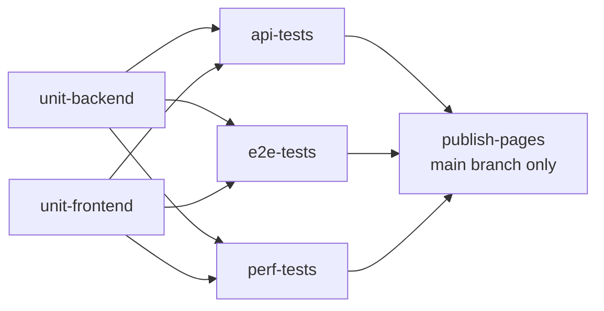
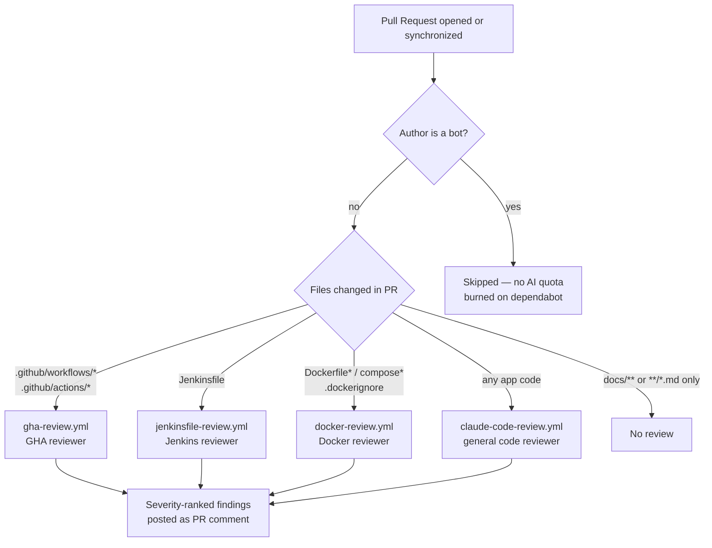
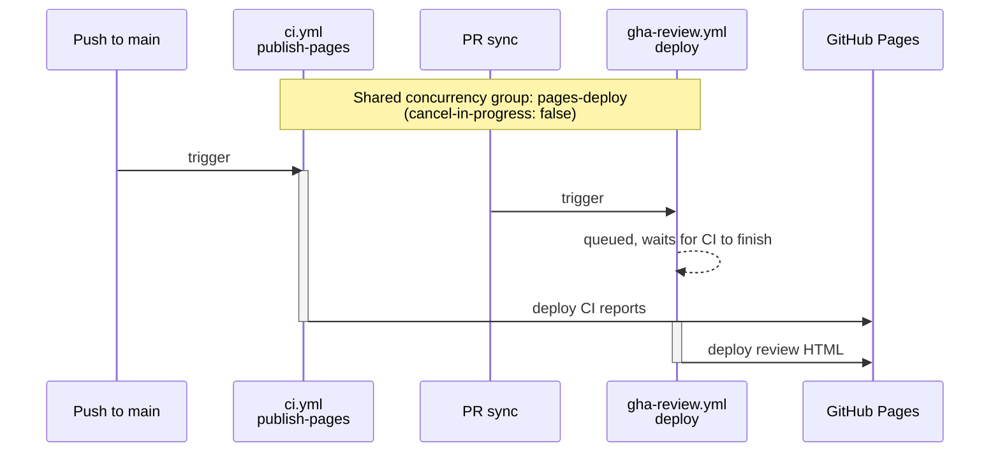

# Bug Tracker — CI/CD Reference Pipelines

A reference implementation of QA test-automation CI/CD on two parallel stacks: **GitHub Actions** and **Jenkins**.

The bug-tracker application (Go backend, Next.js frontend) is the test substrate — the value of this repository lies in how the pipelines are designed, what they enforce, and how the two stacks stay functionally equivalent.

For application setup, local dev commands, and stack details, see [APP.md](./APP.md).

---

## Repository Layout

```
.github/
├── workflows/                     # GHA workflow files (see Workflow Matrix below)
│   ├── ci.yml                     #   main CI — tests + reporting + GitHub Pages
│   ├── gha-review.yml             #   AI review of .github/workflows + .github/actions
│   ├── jenkinsfile-review.yml     #   AI review of Jenkinsfile changes
│   ├── docker-review.yml          #   AI review of Dockerfile + docker-compose + .dockerignore
│   ├── claude-code-review.yml     #   AI review of application code
│   └── claude.yml                 #   @claude mention responder
├── actions/
│   └── publish-test-results/      # Composite action — JUnit check + HTML artifact
└── pages/
    └── index.template.html        # Landing page template for Pages site

jenkins/                            # Dockerfile + docker-compose for a local Jenkins instance
Jenkinsfile                         # Declarative pipeline (mirrors ci.yml stages)

bugtracker-backend/                 # Go application (test substrate)
bugtracker-frontend/                # Next.js application (test substrate)
tests-api/                          # Playwright API tests
tests-e2e/                          # Playwright browser tests
tests-perf/                         # k6 performance tests

docs/references/                    # Deep platform-specific best-practice references
```

---

## GitHub Actions — Workflow Matrix

Six workflows divide responsibility by **trigger zone**. Each owns one slice of the repo and stays out of the others' way — a PR triggers exactly the workflows that matter for what it changed.

| Workflow | Triggered on changes to | Purpose | Bot filter |
|---|---|---|---|
| `ci.yml` | application code, `Dockerfile`, `docker-compose`, `.github/actions/**` | Run all tests (unit + API + E2E + perf), publish JUnit checks, deploy reports to GitHub Pages | — (not AI) |
| `gha-review.yml` | `.github/workflows/*.yml`, `.github/actions/**/action.yml` | AI review of GHA workflow files against project best practices; comments severity-ranked findings on PR | yes |
| `jenkinsfile-review.yml` | `Jenkinsfile` | AI review of the Jenkins pipeline against project best practices | yes |
| `docker-review.yml` | `**/Dockerfile*`, `**/docker-compose*.yml`, `**/compose.y?ml`, `**/.dockerignore` | AI review of Docker images and Compose stacks against project best practices | yes |
| `claude-code-review.yml` | everything else (app code), except: `Jenkinsfile`, all workflow YAML, Docker files, `.dockerignore`, docs, markdown | General AI code review of application changes | yes |
| `claude.yml` | `@claude` mentions in issues / PR comments | Responds to direct mentions in conversation | n/a (mention is the filter) |

### Trigger logic

The six workflows are deliberately mutually exclusive on most file changes:

- PR changing **application code** → `ci.yml` (tests) + `claude-code-review.yml` (AI review)
- PR changing **`.github/workflows/**`** → `gha-review.yml` only — `ci.yml` excludes all workflow YAML via `paths-ignore`
- PR changing **`.github/actions/**`** → `gha-review.yml` + `ci.yml` — the composite action (`publish-test-results`) is used inside `ci.yml`, so tests re-run to validate it
- PR changing **`Jenkinsfile`** → `jenkinsfile-review.yml` only
- PR changing **`Dockerfile*` / `docker-compose*.yml` / `.dockerignore`** → `docker-review.yml` (best-practice review) + `ci.yml` (image rebuild + tests against the new image)
- PR changing **docs / README only** → no workflow runs at all — no AI quota spent on prose

`ci.yml` *does* re-run on changes to the composite action `publish-test-results` because that action is used inside it. It does **not** re-run on changes to its own YAML — validate workflow edits via `workflow_dispatch` (manual run from the Actions tab) to avoid burning 20 minutes of tests on a comment change.

### `ci.yml` — job dependency graph

The CI pipeline has six jobs. Unit tests gate the three integration suites; Pages publication runs only after all integration suites succeed on `main`.



Each integration job spins up its own `docker compose` stack — separate state, no shared fixtures between API / E2E / perf. A failure in one integration suite does not block the others from running; only `publish-pages` requires all green.

---

## Claude Code on Pull Requests

Five Claude-powered workflows run on PRs in parallel, each specialized to a domain. This is **not a single AI reviewer** — it's a multi-reviewer architecture where the right specialist is dispatched by the files in the diff, a general reviewer fills the gap for everything else, and an `@claude` mention provides on-demand interaction without burning a full automatic review.



Separately, `claude.yml` responds to **`@claude` mentions** in any PR or issue comment — interactive, on-demand, not automatic. Ask "look at job X, why is it flaky?" in a comment and Claude reads the conversation context and answers inline.

### Properties of this design

- **Dispatched by `paths` / `paths-ignore`.** Each reviewer triggers only on the files it understands. A PR touching both `.github/workflows/ci.yml` and `bugtracker-backend/main.go` gets a GHA-best-practices review *and* a general code review — but never two general reviews on the same change.
- **Specialized reviewers carry domain checklists in their prompts.** `gha-review.yml`, `jenkinsfile-review.yml`, and `docker-review.yml` ship full project-specific rule sets (default-deny permissions, SHA pinning, `post`-block design, CPS gotchas, agent strategies, multi-stage builds, layer caching, healthchecks, etc.) baked into the action's `prompt:` input. The general reviewer doesn't try to be an expert in every YAML dialect.
- **Bot-author filter on every automatic reviewer** (`if: ${{ !contains(github.actor, '[bot]') }}`). Dependabot / Renovate PRs skip AI review entirely — saves quota on mechanical bumps. `ci.yml` (tests) still runs on bot PRs as normal.
- **Docs / markdown PRs trigger nothing.** A pure README fix doesn't burn AI quota or runner minutes — `paths-ignore: ['docs/**', '**/*.md']` is set on every reviewer.
- **One PR comment per reviewer.** Each posts its findings as a separate severity-ranked comment (Critical / High / Medium / Low). Multiple reviewers on the same PR produce multiple comments, not one mixed-domain summary.

---

## Jenkins Pipeline

The `jenkins/` directory contains a `Dockerfile` and `docker-compose.yml` for running Jenkins locally:

```bash
cd jenkins
docker compose up --build
# Jenkins available at http://localhost:9000
```

The root `Jenkinsfile` mirrors `ci.yml` stage-for-stage. See [docs/references/jenkins-best-practices.md](./docs/references/jenkins-best-practices.md) for the deep dive on declarative syntax, shared libraries, agent strategies, credential bindings, parallel sharding, and `post`-block design.

---

## Cross-stack Parity

Both stacks run the same QA pipeline. The intent is to show how the same workflow maps onto two ecosystems and where the platforms force different trade-offs (caching primitives, secret handling, parallelism, reporting hooks).

| Stage | Jenkins | GitHub Actions |
|---|---|---|
| Checkout | `checkout scm` | `actions/checkout` |
| Tool setup | `tool` directive / `withMaven` | `actions/setup-*` with built-in `cache:` |
| Dependency cache | Pipeline Utility `cache` step | `setup-*/cache:` option |
| Parallel test shards | `parallel { }` block | matrix `strategy` with `fail-fast: false` |
| Test results | `junit` step | `dorny/test-reporter` |
| HTML report | `publishHTML` plugin | artifact upload + `deploy-pages` |
| Failure artifacts | `archiveArtifacts onlyIfSuccessful: false` | `upload-artifact` with `if: ${{ !cancelled() }}` |

Where the platforms force a real divergence (OIDC support, container execution model, agent allocation), it is documented inline in the pipeline files.

---

## Operations

### GitHub Pages

CI test reports are published to GitHub Pages on every successful push to `main` by `ci.yml`'s `publish-pages` job. The landing page (`./` of the Pages site) links to per-suite reports:

- `/backend/` — Go coverage HTML
- `/frontend/` — Jest coverage
- `/api/` — Playwright API report
- `/e2e/` — Playwright browser report
- `/perf/` — k6 HTML summary

Pages publication is **serialized** via a workflow-spanning concurrency group named `pages-deploy`. Both `ci.yml` and `gha-review.yml` (which also deploys to Pages) share this group, so deploys never race or overwrite each other:



Without the shared group, both workflows would race — `actions/deploy-pages` serializes server-side, but the order would be non-deterministic and the last writer's content wins.

The landing page itself is rendered from `.github/pages/index.template.html` via `envsubst` with an explicit variable whitelist (`SHORT_SHA`, `TIMESTAMP`, `RUN_NUMBER`), so no other environment variable — including `GITHUB_TOKEN` — can leak into the rendered HTML.

### Validating workflow edits

`ci.yml` does not auto-trigger on changes to its own YAML. To validate edits manually:

1. Push the change to your branch
2. Go to **Actions → CI — Build, Test & Report → Run workflow**
3. Select your branch, click **Run workflow**

`workflow_dispatch` is configured on all CI workflows for exactly this purpose.

### Running tests locally

See [APP.md](./APP.md) for application setup and local test commands.

---

## Key Patterns Applied

Practices enforced across both Jenkins and GHA in this repo:

- **SHA-pin every third-party action.** Pinning by tag (`@v4`) is mutable; only full-SHA pinning is supply-chain-safe.
- **Default-deny workflow permissions.** Workflow-level `permissions: { contents: read }`; per-job grants add only what that job needs.
- **`if: ${{ !cancelled() }}` over `always()` for reporting and cleanup.** `always()` runs even on user-initiated cancellation; rarely what you want.
- **Shared concurrency group for GitHub Pages.** Two workflows publishing to the same Pages site must share a `pages-deploy` group to prevent race conditions and last-writer-wins surprises.
- **`--body-file` for safe `gh pr comment`.** Body content passed inline (`--body "..."`) is shell-interpolated and vulnerable to backticks, `$(...)`, and quotes in the text; `--body-file` bypasses the shell parser entirely.
- **Single-quoted heredoc (`<<'EOF'`) inside `withCredentials` and shell prompts.** Stops `$`, backticks, and `${{ }}` from being interpolated before the command runs.
- **JUnit XML from k6 via `handleSummary`.** No xk6 extensions needed — emit JUnit inline so the perf job posts a native test check on both GHA and Jenkins.
- **`envsubst` with explicit variable whitelist.** Templates rendered into Pages or CI artifacts use `envsubst 'VAR1 VAR2' < template` to prevent accidental secret interpolation.

---

## Further Reading

- [docs/references/github-actions-best-practices.md](./docs/references/github-actions-best-practices.md) — GHA-specific deep practices (composite actions, OIDC, matrix strategies, caching)
- [docs/references/jenkins-best-practices.md](./docs/references/jenkins-best-practices.md) — Jenkins shared libraries, agent strategies, CPS, credentials
- [docs/references/docker-best-practices.md](./docs/references/docker-best-practices.md) — Docker multi-stage builds, layer caching, base images, USER vs bind-mount trade-offs, Compose healthchecks
- [APP.md](./APP.md) — bug-tracker application setup, dev commands, structure
- [CLAUDE.md](./CLAUDE.md) — project intent and working agreement for Claude Code sessions

---

## License

MIT — see [LICENSE](./LICENSE).
